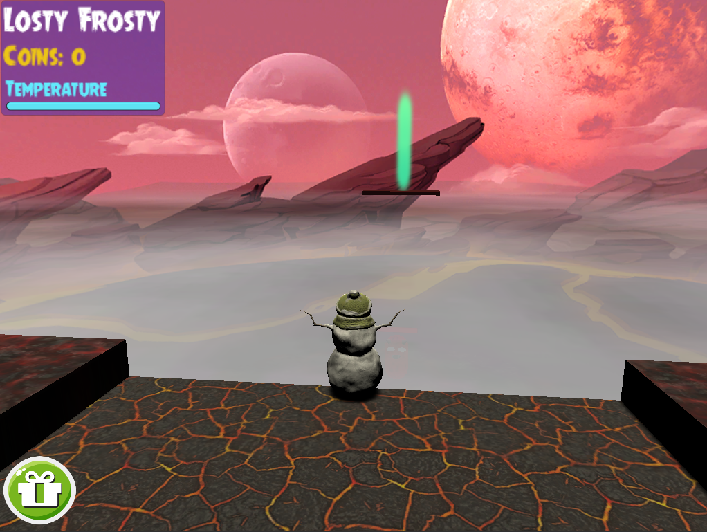

# COMP30019 Graphics and Interaction - 2020S2 Project 2

## Table of contents
* [Team Members](#team-members)
* [Technologies](#technologies)
* [How to run](#how-to-run)
* [Introduction](#introduction)
* [Explanation of the Game](#explanation-of-the-game)
* [How to use the Game](#using-the-game)
* [Object and Entity Modelling](#object-and-entity-modelling)
* [Graphics Pipeline](#graphics-pipeline)
* [Camera Motion](#camera-motion)
* [Explanation of the Shaders](#explanation-of-the-shaders)
* [Evaluation](#evaluation)
* [Changes made based on Evaluation](#changes-made-based-on-evaluation)
* [Attributions](#attributions)
* [Individual Contributions](#individual-contributions)

## Team Members

| Name | Task | State |
| :--- | :---: | ---: |
| Andrew Naughton | Tutorial, Level 1 and 2, Menus, Code Organisation, Readme | Complete |
| David Naughton | Level 4, Shaders, Shop Menu, Blender Models, Enemy AI, Readme | Complete |
| Jiseong Oh | Camera, Level 3, Settings Menu, Particle and Sound Effects | Complete |

## Technologies
Project is created with:
* Unity 2019.4.3f1
* C#
* Shaderlab

## How to Run
1. Clone this repository
2. Import root directory into Unity Hub
3. Open `Scenes/MainMenu.unity` in Unity Editor
4. Be sure to set your `Game` view to **Standalone (1024x768)** -- **If you play the game with a different aspect ratio, the UI elements will not align as intended**
5. Press Play OR Open `File->Build Settings` and `Build` the game into an executable application for your computer
6. Enjoy!

## Introduction
>## Task
> Develop and evaluate a simple game of any type of your choosing using Unity.

Our team developed **Beat The Heat**, a [3D Platformer](https://en.wikipedia.org/wiki/Platform_game#The_third_dimension) where a Snowman named *Losty Frosty* (Losty) must escape four layers of Hell. In this project, we explored how to:
- Facilitate user interaction
- Create and render objects
- Orientate, position, and move a camera to create a comfortable user experience
- Manage the graphics pipeline to run without substantial lag
- Evaluate a game with participants, and make improvements based on the collected information

### Demonstration

To watch a video demonstration of our game, follow [this link](https://www.youtube.com/watch?v=thyUY0E7xBY).

<p align="center">
  
</p>

## Explanation of the game
*Beat The Heat* is a [3D Platformer](https://en.wikipedia.org/wiki/Platform_game#The_third_dimension) that tells the story of Losty, a wary Snowman who is lost in the depths of Hell. The user plays as Losty as he tries to navigate his way out of Hell and return to his home in the North Pole.

There are four levels in the game, which Losty must pass to escape Hell and return home. The objective of each level is to make it to the Green Portal without *melting*. 

Melting to a Snowman is equivalent to death. Losty will melt if he falls off the track or if his temperature gets too high due to collisions with Ghosts or Gargoyles' Fireballs (Fireballs).

<p align="center">
  
</p>

Each level presents unique challenges, such as avoiding Ghosts and Fireballs, jumping gaps in the track, jumping between moving platforms, solving puzzles, and fighting bosses.

Throughout the game, *Coin Objects* can be collected and used in [`Yeti's Shop`](https://en.wikipedia.org/wiki/Yeti) to purchase upgrades to Losty's speed, jump, and maximum temperature.

Additional features include:
-  A `Tutorial` where users can learn the game controls interactively
- A `Pause` menu to halt the game
- A `Controls` menu where users can quickly remind themselves of the in-game controls
- A `Settings` menu where the user can control the `sensitivity` of the camera and the  `difficulty` of the game through controlling the `chase speed` of the Ghosts and the `fire rate` of the Fireballs.

## Using the game
The interaction between the game and user is designed to be simple and intuitive.

### Main Menu Interface
The game opens to a `Main Menu` where the user can choose between the following:

1. Start to `Play` the game straight away
2. Take a `Tutorial` to learn the controls interactively
3. Read the in-game `Controls` guide
4. View and edit the game `Settings`

<p align="center">
  
</p>

### Controls
*Beat The Heat* is a [PC game](https://en.wikipedia.org/wiki/PC_game) that can only support keyboard and mouse as an input mode. We use `W`, `A`, `S`, `D` keys to move Losty forward, left, back, and right, respectively, and `Space` bar for his jumping action. We control Losty's yaw aspect, i.e. the camera's horizontal field of view, with the`Mouse` (NB: pitch is fixed). Finally, `Left Mouse Click` is used to shoot Snowballs (NB: only available in Level 4 Boss Fight).

Bearing in mind the location of the user's movement keys, we selected the following nearby key binds to create a better user experience:
- `Left Tab` to open and close the `Pause` menu

<p align="center">
  
</p>

- `Left Shift` to halt/resume the game and show/hide `Yeti's Shop` to buy upgrades

<p align="center">
  
</p>

- `Escape` to close any open menus, such as `Pause`, `Yeti's Shop`, and `Controls` (accessible from `Pause`)

<p align="center">
  
</p>

### Heads-Up Display (HUD)
The HUD is intentionally unobtrusive and minimal, so as not to occlude the screen space. We only include the essential statistics in the top left corner, including Losty's Temperature and Score, and a Shop Button in the bottom left corner.

<p align="center">
  
</p>

#### Temperature
Losty's Temperature bar tracks how hot he is at any moment. The user should keep an eye on this, because Losty melts (dies) if his Temperature Bar becomes completely red.

#### Score
Losty's Score tracks how many *Coin Objects* he has collected. Each *Coin Object* acquired adds 5 points/Coins to Losty's Score.

Losty's Score determines what he can buy in `Yeti's Shop`. For example, `x2  Temp` is an upgrade that requires Losty to have 100 points/Coins. 

If he melts, Losty loses all of his points/Coins and any upgrades he has bought.

## Object and Entity Modelling
We set out to create a Hell landscape to support the game narrative. Our goal was to design a unique look and feel for our game, so we avoided importing Unity Standard Assets as much as possible.

The only models that we did not create ourselves (i.e. sourced from the Unity Asset Store) were the Tomb, Gargoyle, and Snowman. 

<p align="center">
  
</p>

We utilised a few basic Unity 3D Shapes:
- Cubes were used for starting platforms, finish platforms, and the elevators
- Capsules for the Ghosts' bodies

Everything else we made ourselves in Blender and imported to Unity. We built two track pieces: a straight and a corner. Stitching these together proved difficult, but once we had these building blocks it was easy to scale up to create unique and interesting tracks for each level.  

We designed a face for the Ghosts to give them a scary appearance and more character than just a capsule. We constructed horns for the Boss to give it the appearance of the devil.

Finally, we made a *ring* shape for the boss’ pulse attack, which we made out of many small cubes.

<p align="center">
  
</p>

## Graphics Pipeline
We decided early on to set a target frame rate of 30 frames per second. We got to a point in development of our game where the frame rate was dropping below this and we noticed that some of our levels were trying to render upwards of 10 million vertices. We knew this was not caused by our own models, so we inspected the vertices of the Tomb and Gargoyle models we had sourced online and found that both had an extreme number of vertices.

The Gargoyle and Tomb had approximately 30,000 and 50,000 vertices respectively. Each level had many of these models and rendering all of their vertices saw our frame rate drop substantially. To reduce the load of the rendering pipeline, we replaced our Gargoyle model for one we found on the Unity Asset Store with approximately 4,000 vertices.

The Tomb was made of several pieces and on inspection we discovered that one piece was responsible for the vast majority of vertices and yet it looked like a simple cube. We swapped it out for a Unity 3D Cube with the same dimensions and material applied to it.

With these changes, our vertex count went from approximately 10 million to consistently less than 1 million. Our frame rate issues disappeared and these modifications substantially improved the quality of our game in terms of performance and lag.

## Camera Motion
We chose to implement a third person camera. The camera sits behind and above Losty at a constant position relative to him and looks slightly over his head. The yaw of the camera is controlled by the mouse such that if Losty looks left the camera looks left as well. The only exception is when Losty falls off the terrain and below a threshold height, the camera fixes its position and looks at Losty as he falls to his death.

<p align="center">
  
</p>

We noticed that the lighting was a lot better when the directional light aligned behind Losty so that he was fully illuminated. However, as Losty would change direction, if the directional light was constant, then shadows would appear on him which made gameplay harder. Therefore, we decided to move the directional light to stay constantly behind Losty regardless of his direction.

## Explanation of the Shaders
### Ghost Body Shading
We developed a custom Shader for the Ghost bodies in our game, which implements the Phong illumination model in much the same way as we were shown in Workshop 6. 

However, there are the following differences:
- Directional light is used in our game rather than point light. This means that when we calculate the light direction vector we do not have to calculate this from the light position and object surface.

- We want our ghosts to be transparent so we have changed the *tags*:
	``` C
	Tags {"Queue"="Transparent"  "RenderType"="Transparent"}
	``` 
- And used a transparency variable to control the value of the `alpha` channel of `color`:
	``` C
	return  float4(color,_Transparency);
	```

The Phong illumination model breaks the illumination of an object down into three components: ambient, diffuse and specular.

- Ambient light is the base amount of light in the scene. It is calculated as the product of Unity’s default ambient light intensity and the texture colour (RGB).
	``` C
	float3 ambient = UNITY_LIGHTMODEL_AMBIENT.rgb * tex.rgb;
	```

- Diffuse is the light that is reflected off the surface of an object in all directions. It is calculated as the dot product of the directional light and the surface normal vectors which give the light intensity multiplied by both the col­­our of the directional light and the texture colour.

	``` C
	float3 diffuse = _LightColor0.rgb * tex.rgb * saturate(LdotN);
	```

- ­­Specular is the light that hits the surface and is reflected towards the camera. The specular highlights which appear on the surface of the object from the perspective of the camera can be either large and dull or small and intense. This is what we refer to as shininess. Specular light intensity is calculated as the dot product of the vector from object surface to the camera and the vector of the light reflected off the object surface (directional light vector reflected about the surface normal). The shininess is the exponent of the specular light intensity. This term is then multiplied by the colour of the directional light.
	``` C
	float3 specular = _LightColor0.rgb * pow(VdotR, _Shininess);
	```
How an object appears according to the camera is the sum of the three components. 
``` C
float3 color = _ambientFactor*ambient + _diffuseFactor*diffuse + _specularFactor*specular;
```
In order that an object does not appear brighter than the light incident on it, the sum of the weights of diffuse and specular light should not exceed 1. We have chosen the following weighs `diffuse = 0.95`, `specular = 0.05`, `shininess = 1` and `transparency = 0.8`. Ghosts should have low shininess and specularity and high transparency.

<p align="center">
  
</p>

### Fog Shading
We developed a custom Shader to give a fog effect to our levels. The fog did not implement the Phong Illumination model or any other model taught in the workshops. For this effect we found [this website](http://www.shaderslab.com/demo-76---fog.html) and used the video and code to implement the fog Shader. We also used the fog texture linked on the page.

We attached the fog Shader to a large plane covering the entire `x`, `z` area used in each level. This produces a nice fog effect that partially obscures the part of the skybox under the track.

The fog Shader has some similar features to the ghost Shader. It has the same *transparent* tags for queue and render type and uses a single texture. Culling is turned off so that we can see the fog plane from above and below which is important for level 4 when you move from above the fog to below it to fight the boss.

The input to the vertex Shader is `appdata_full` although it only uses vertex coordinates, texture coordinates and vertex colours. The output from the vertex Shader is `pos` which contains the screen space coordinates of the vertex, `uv` which contains the texture coordinates with offset and tiling of the main texture, `uv2` which contains the texture coordinates, `vertCol` which contains the vertex colour (since we are using a Unity Plane, this is not defined).

``` C
v2f vert(appdata_full v) {
	v2f o;
	o.pos = UnityObjectToClipPos(v.vertex);
	o.uv = TRANSFORM_TEX(v.texcoord, _MainTex);
	o.uv2 = v.texcoord;
	o.vertCol = v.color;

	return o;
}
```

The fragment (pixel) Shader then picks up the interpolated outputs and calculates:
1. `uv` which is the interpolated UV coordinates plus an offset equal to the `(x, y)` scrolling coordinates multiplied by distance `speed * time`. To understand this, consider what happens when `time = 0`, the UV coordinate has no offset. When `time = 1` then the UV coordinate will have an offset equal to the `(x, y)` scrolling coordinates times by `distance = 1 * speed`. So, as time becomes greater, the offset moves a greater distance each time in the direction of `(x, y)` scrolling coordinates which gives the effect of the fog moving.

	``` C
	float2 uv = i.uv + fixed2(_ScrollDirX, _ScrollDirY) * _Speed * _Time.x;
	```

2. `Col` which is the colour of the texture at the UV coordinate defined in [1] multiplied by the `_Color` parameter (we have left as the default white).

	``` C
	fixed4 col = tex2D(_MainTex, uv) * _Color;
	```
	
3. `Col.a` (alpha channel of colour) is updated by multiplying its alpha value from [2] by the colour of the Mask texture at the original input UV coordinates (not from [1]). The mask is used to store transparency weightings in its `r` (red) channel. This gives the effect of fog density fluctuating between opaque and transparent.

	``` C
	col.a *= tex2D(_Mask, i.uv2).r;
	```
4. `Col.a` (alpha channel of colour) is updated again by multiplying it with 1 minus the fading distance times the screen space pixel coordinates `z / w`. However, since the vertex position vector is a position and not a direction, the `w` component should be 1. Therefore, this reduces to just `z`, which is the `depth`. In our case we are applying fog to a Plane, which has no depth. Hence, the fading distance is redundant and we end up just multiplying by 1.

	``` C
	col.a *= 1 - ((i.pos.z / i.pos.w) * _Distance);
	```

Finally, we return the colour of the pixel based on the above and achieve the great fog effect!

<p align="center">
  
</p>

## Evaluation
We asked 10 people to review our game. These were mostly friends of ours from university and school of similar age (20-30), male and Caucasian/Asian. We also had an older female (one of our mothers) test the game to diversify the perspective. 8 of the 10 participants had past experience playing video games.

### Think-Aloud (Observational Method)
For the first 5 participants we employed an observational method of evaluation called *Think-Aloud*. With this technique we observed the participants playing the game in real time (either over video call, or in person). We asked the participants to describe their thoughts and actions as they played the game and recorded them so we could reference later. We did not provide any instructions or information to the participants about the game during the test as we wanted to see how easy/hard it was for users to work things out from the game itself.

The recording was done using audio recorders. When we were present in person, we used a mobile app (Sound Recorder) and if communicating over video call we used the Windows Xbox Recorder.

The *Think-Aloud* method was simple to implement and provided great insight into how users are likely to react to our game. The limitation was that the multi-tasking of playing the game and talking to us at the same time may have altered task performance. In fact, we noticed that the users did less talking at times where the gameplay was challenging and required more focus. Another limitation is that the participants did not always know what we wanted them to talk about as we were not prompting them. So, at times we didn’t get as deep insights as we would have liked.

The feedback we received from this round of evaluation covered many different aspects of the game.

| Observations|
| :--- |
| Some of the participants skipped the tutorial in favour of checking out the controls screen or going straight to level 1 and checking the controls screen through the pause menu.|
| One participant tried to use the arrow keys instead of WASD to move and found it extremely hard to manage the mouse to change directions and space bar to jump simultaneously. |
| Most did not check the settings before starting level 1 and came back to it if they were struggling with the difficulty or the mouse sensitivity. |
| One changed the fire rate but the measurement convention didn’t agree to the label and this created confusion. |
| Some felt like they had to collect every coin initially because they were not sure of the scarcity of coins relative to the price of upgrades which is natural. |
| Jumping was hard for players initially and most found it hard to pass level 1 due to the moving platforms initially but improved quickly. |
| Some players were surprised when the upgrades purchased were persistent after death. |
| Most players struggled with the moving platforms on level 3. Some said the depth of the moving platforms was hard to gauge. |
| One participant did not realise you had to solve a puzzle at all and repeatedly tried to jump an impossible gap which they found very frustrating. |
| One player couldn’t solve the puzzle. |
| Most players worked out that they needed to take a leap of faith into the abyss in level 4. |
| Most players who made it to level 4 had learned the controls well enough to beat the boss in less than 5 goes. |

### Interview (Querying Method)
For the other 5 participants we employed the *Interview* querying technique whereby the user first plays the game on their own and then we interview them afterwards. We favoured open questions over closed questions. Our prepared questions were as follows:
| Questions|
| :--- |
| What did you find most challenging about the game? |
| Which UI aspects you think could be improved? |
| How did you find the game controls? |
| How did you manage the difficulty of the game? |
| How does the game feel? Is there anything that bugs you or does not work? |
| What was your understanding of the story told by the game? |
| Do you have any comments or suggestions on ways to improve the game experience? |

However the interview did not follow a strict script and went in different directions depending on their responses. This allowed us to home in on the biggest issues with the game.

The interviews were done over video link or simply via chat messages. Where chat was used the conversation was recorded in chat history. If done over video, an audio recording was taken to refer back to later.

The interview evaluation technique had some advantages and disadvantages over the *Think Aloud* technique. The main disadvantage was that since the interview took place after the user had finished playing the game we had to rely on their memory of playing it which is less reliable than real time feedback. This can be due to the user forgetting details of the game or their mind otherwise distorting memories of the actual experience. We found that we often missed out on the spontaneous insights which were picked up from the *Think Aloud* evaluation.

The main advantage was that we could use the interview to focus the questioning where we felt issues might lie within the game which the user might not have focused on during *Think Aloud*. For example, we did not get as much feedback on the more difficult or engaging tasks such as the puzzle and the boss fight during *Think Aloud*. Whereas, during the interview we could ask users directly how difficult they found the puzzle and how they approached the problem. We also learned that we lacked feedback from *Think Aloud* on game aspects which the user often takes as given such as the layout and colours of the menu and the clarity of the game objective.

The feedback we received from this round of evaluation included:

| Observations|
| :--- |
| All participants were clear on the objective of getting to the green portal to progress, avoid enemies and not falling off the track. |
| Some players found the speed upgrade made navigating moving platforms harder rather than easier. However, they found it helpful when trying to defeat the boss in level 4. |
| Some players said the puzzle in level 3 was too hard to complete with a Gargoyle shooting you while trying to solve it. |
| Most picked up the controls quickly, but some took a while to adjust to the camera sensitivity and some thought it was too sensitive by default. |
| Most found the menus easy to navigate and the colours appropriate |
| All thought the theme was consistent throughout the game.
| Most understood the game narrative, although narrative devices such as game dialogue was limited to user instructions (controls and objectives) rather than story/character development. |
| One user found the temperature bar confusing as it didn’t go from low temperature to high temperature. |
| One user thought he kept trying to close the shop with escape, so suggested it would be good to add this key bind to controls. |
| Some said that sound effects/sound track would make the game more engaging. |

## Changes made based on Evaluation
Based on the feedback we received from the Evaluation above, we made the following changes to the game:

- Reversed the direction of the temperature bar so Losty’s temperature starts low and gets higher as Losty is hit by Ghosts and Fireballs.

- Reversed the direction of the fire rate slider so as the slider increases the frequency of Fireballs fired increases.

- Implemented an additional `esc` key bind which exits from the shop and pause menus.

- Reduced the default sensitivity of the mouse which controls the camera yaw.

- Deactivated Fireball shooting script from the Gargoyle near the puzzle so it is easier for the user to focus on the puzzle.

- Made the puzzle clues easier to interpret (simplified text).

- Signposted the puzzle with text pop-up, so it is clear to users they need to solve puzzle to progress.

- Amended Shop Upgrades/Purchases logic so that they no longer persist after death.

- Added background music as well as sound effects for certain actions, e.g. collecting coins.

- Increased the Health of the Boss in Level 4 to make the Boss Fight more challenging.

## Attributions
We have drawn inspiration or borrowed source code from the following resources in creating *Beat The Heat*:
- [Hell Skybox](https://assetstore.unity.com/packages/templates/fps-microgame-156015?_ga=2.70389520.1241549832.1604480560-916090643.1595917795)
- [Fog Shader Code](http://www.shaderslab.com/demo-76---fog.html)
- [Gargoyles' Fireball Particle Effect](https://www.youtube.com/watch?v=OWShSR6Tr50)
- [Feline Gargoyle](https://assetstore.unity.com/packages/3d/props/feline-gargoyle-27106)
- [Snowman](https://assetstore.unity.com/packages/3d/props/free-snowman-105123)
- [Tomb](https://free3d.com/3d-models/tomb)

Our Music, Sound and Cartoon Effects have the following origins:
- Music in Main Menu, Settings, Controls, Walkthrough, Level 1-3: Halo Combat Evolved OST 26 -- Halo
- Music in every End-of-Level Scene: The Halo 3 OST -- Warthog Run
- Music in Level 4: Desert sound by Classical and Relax (2015)
- Music in Level 4: DOOM Eternal OST -- The Only Thing They Fear Is You
- Music in Game Complete Scene: Fortnite OST -- Season 7 Festive Lobby
- Losty Damaged Sound Effect: Roblox Death Sound -- Roblox
- Snowball Throw Sound Effect: Cartoon Throw Away Sound (Pew) -- Team Sound Effect
- Coin Collect Sound Effect: Enchantment Table Sound -- Minecraft
- Teleportation Sound Effect: Enderman Teleport Sound -- Minecraft
- Boss Explosion Sound Effect: Vine Boom Sound -- Jesse Lander
- Cartoon Effect -- Jean Moreno (2015)

## Individual Contributions
| Name | Contributions |
| :--- | :---: |
| Andrew Naughton | Tutorial, Level 1, Level 2, Menus, Code Organisation, Readme |
| David Naughton | Level 4, Shaders, Shop Menu, Blender Models, Enemy AI, Readme |
| Jiseong Oh | Camera, Level 3, Settings Menu, Particle and Sound Effects |
